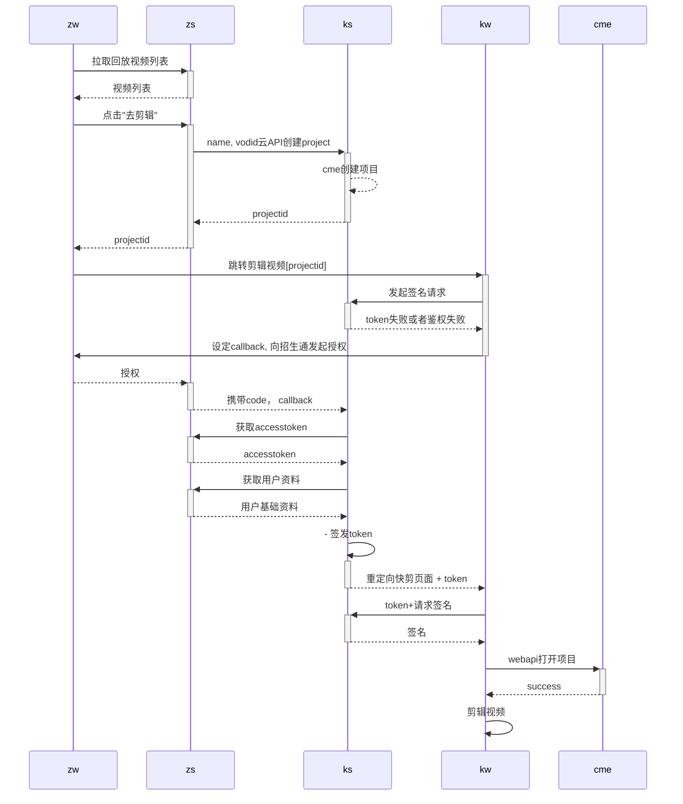

## OAuth




<<<<<<< HEAD

=======
```
 kw->> +ks:token, projectid, vodid创建
    ks->>cme:创建项目
    cme-->>ks: projectid
    ks-->>kw: 创建成功
    kw->>kw: 剪辑视频
    ks-->>-zs: 回调告知zs, porjectid创建成功或失败
    zs->>zs: 修改项目状态，或者删除记录
```
>>>>>>> f07a145de0894bf4f24b41c5910edf7ba23e02e3

