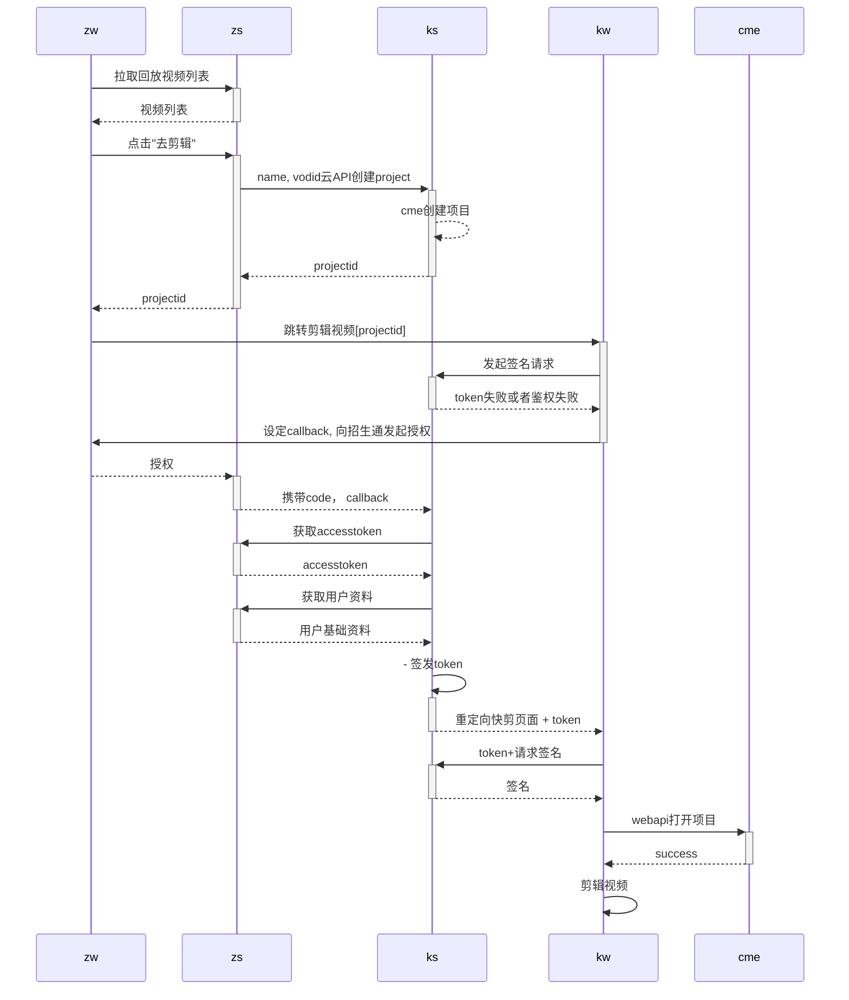

## OAuth


A）client 请求 resouce owner 授权
B）resouce owner 授权 client 的访问
C） client 使用 resouce owner 的授权，去 authorization server 验证
D） authorization server 验证通过，颁发 access token
E） client 请求访问 resource server，并提供 access token
F） resource server 校验 access token，并返回受保护的资源

```
 kw->> +ks:token, projectid, vodid创建
    ks->>cme:创建项目
    cme-->>ks: projectid
    ks-->>kw: 创建成功
    kw->>kw: 剪辑视频
    ks-->>-zs: 回调告知zs, porjectid创建成功或失败
    zs->>zs: 修改项目状态，或者删除记录
```

# 问题
## 令牌与密码区别
令牌（token）与密码（password）的作用是一样的，都可以进入系统，但是有三点差异。

（1）令牌是短期的，到期会自动失效，用户自己无法修改。密码一般长期有效，用户不修改，就不会发生变化。

（2）令牌可以被数据所有者撤销，会立即失效。以上例而言，屋主可以随时取消快递员的令牌。密码一般不允许被他人撤销。

（3）令牌有权限范围（scope），比如只能进小区的二号门。对于网络服务来说，只读令牌就比读写令牌更安全。密码一般是完整权限。

## 如何保证client的合法性？
一般开放平台都会为client分配appid和appsecret，这个需要client到开放平台上做注册认证，请求的时候携带。

## 如何知道获取什么资源授权？
这个有第三方应用发起而定，比如第三方app使用微信或者qq登陆，一般只需要获取openid，头像就够了，也有流氓的上来获取手机号，好友关系链的。在获取的时候调用的api可能不同，或者api的参数不同。这个会拉起用户确认的，用户一定要check清楚授权的具体内容

## oauth是基于https
保证授权code以及accesstoken令牌不会被劫持窃听

## 如何告知第三方？
重定向到请求中redirect_uri指定的地址。这个一般是第三方应用的服务地址

## oauth2.0 CSRF攻击流程

# 参考
1. [OAuth 2.0 的四种方式](https://www.ruanyifeng.com/blog/2019/04/oauth-grant-types.html)
