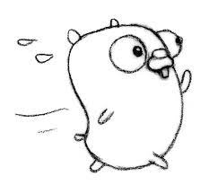

<!--
_class: lead default
_paginate: false
-->

# Go设计与实现
_Let's Go!_

---
# Go的历史 [->](https://github.com/golang-design/history#language-design)
 

---
## Go创造者
<style>
img[alt~="center"] {
  display: block;
  margin: 0 auto;
}
img[alt~="left"] {
  float: left; 
  margin: 15px; 
}
table {
  width: 100%;
}
</style>


|Robert Griesemer|Rob Pike |Ken Thompson |
|:---:|:---:|:---:|
|V8/Go|UTF-8/Plan9/Go|Unix/B/Plan9/UTF-8/Go|


---
## Go历程
- 2008.03.03 Griesemer 起草
  [Go is an attempt at a new systems programming language.](https://github.com/golang/go/blob/18c5b488a3b2e218c0e0cf2a7d4820d9da93a554/doc/go_spec)
  
- 2008.03.07 [The Go Programming Language. Language Specification](https://github.com/golang/go/blob/e6626dafa8de8a0efae351e85cf96f0c683e0a4f/doc/go_lang.txt)

- 2008.03.28 完成Go语言文法和语法的制定,随后着手开发编译器
- 2008.06.05 [提交了第一份编译器相关代码(C)](https://github.com/golang/go/commit/0cafb9ea3d3d34627e8f492ccafa6ba9b633a213)
- 2008.09 实习生Russ Cox 加入
- weekly.2009-11-06 ～ weekly.2011-03-07.1(r56第一个稳定版本)
- 2012-03-27 Go1.0发布；基本每年两个版本；最新版本Go1.17.5

---
## Hello World


```B
main( ) {
	extrn a, b, c;
	putchar(a); putchar(b); putchar(c); putchar('!*n');
}
a 'hell';
b 'o, w';
c 'orld';
```

```C
main() {
	printf("hello, world");
}
```

---
# Go编译原理


---
## Go设计原则

- C++一样的系统编程语言，用于服务端或分布式系统
- 构建要十分快，瞬时增量编译
- 面向过程(继承 Pascal/C的传统)
- 强类型; 简洁的语法避免重复
- 很少，正交，通俗的概念
- 支持线程和进程间通信
- GC
- 用 Go 编写的容器库(没有模板)-自举
- 相当高效，相当于C

---
## 编译流程
1. 词法器扫描
2. 语法器解析
3. 创建AST
4. 类型检查
5. 分析重写AST
6. 转换成Static Single-Assignment
7. 生成机器码


---
## 语法是什么？
语法是一门编程语言自身的描述！
$$语法=文法+语义$$


- 文法：描述语言的句法规则
- 语义：解释文法的含义，限定文法推导的一个子集合法

---
## 上下文无关文法

- 描述编程语言的语言
- BNF(Backus-Naur Form-巴科斯范式) 或者 EBNF
  - 数学语言
  - 递归的思想
  - 精确，无歧义
- 文法规则
  - 产生式由左部是一个非终结符，右部是由非终结符和终结符组成的一个符号串
  - 分隔符:=；操作符 |,(),[],{}；终结符、非终结符
  
---


## Go的语法
```sh
Production  = production_name "=" [ Expression ] "." .
Expression  = Alternative { "|" Alternative } .
Alternative = Term { Term } .
Term        = production_name | token [ "…" token ] | Group | Option | Repetition .
Group       = "(" Expression ")" .
Option      = "[" Expression "]" .
Repetition  = "{" Expression "}" .
```
```sh
ForStmt = "for" [ Condition | ForClause | RangeClause ] Block .
Condition = Expression .
```
语法量
- Go1.17 / 88 / free
- C11 / 180 / $60
- C++17 / 1500 / $116

---
## 字符集
uft-8编码的Unicode字符集，变长1~4个字节
```sh
newline        = /* the Unicode code point U+000A */ .
unicode_char   = /* an arbitrary Unicode code point except newline */ .
unicode_letter = /* a Unicode code point classified as "Letter" */ .
unicode_digit  = /* a Unicode code point classified as "Number, decimal digit" */ .

letter        = unicode_letter | "_" .
decimal_digit = "0" … "9" .
binary_digit  = "0" | "1" .
octal_digit   = "0" … "7" .
hex_digit     = "0" … "9" | "A" … "F" | "a" … "f" .
```

---
## 中文编程如何？
```go
package main

import "fmt"

const(
	真 = true
	假 = false
	嗯 = true
	是的 = true
)

func 打印(输出的信息 ...interface{}) {
	fmt.Println(输出的信息)
}

func main() {
	你好 := "Golang"
	打印(你好);
	吃饱了吗:= 真
	if(吃饱了吗 == 嗯) {
		打印("写点代码吧！")
	} else {
		打印("吃饱了再来。")
	}
	return
}
```
---
## 词法元素
<style scoped>
  img[alt~="right"] {
    float: right; 
    margin: 15px; 
  }
</style>
- 注释 
  - // 或者 /**/ 
  - rune 和 string中不有注释 
- 分号
  - an identifier
  - an integer, floating-point, imaginary, rune, or string literal
  - one of the keywords break, continue, fallthrough, or return
  - one of the operators and punctuation ++, --, ), ], or }
- token
  - identifiers, keywords, operators and punctuation  and literals.
    - Integer,Floating-point,Imaginary,Rune,String

---
## 语法分析
<style scoped>
  img[alt~="right"] {
    float: right; 
    margin: 15px; 
  }
</style>
- 自上而下 LL  
  - 从语法树根开始，使用产生式将非终结符号向左展开
  - 实现简单

- 自下而上 LR, LR(n)
  - 从语法树的叶子开始，匹配产生式从右往左规约到非终结符号，最终到达树根
  - 向前预读 n 个token，帮助产生式冲突时识别正确的文法规则
  - 借助规约栈，规约表，实现复杂

---
## Go语法结构1
```go
//语法树根
SourceFile       = PackageClause ";" { ImportDecl ";" } { TopLevelDecl ";" } .
//包条款
PackageClause  = "package" PackageName .
PackageName    = identifier .
//导入包
ImportDecl       = "import" ( ImportSpec | "(" { ImportSpec ";" } ")" ) .
ImportSpec       = [ "." | PackageName ] ImportPath .
ImportPath       = string_lit .
//顶层声明
TopLevelDecl  = Declaration | FunctionDecl | MethodDecl .
//声明
Declaration   = ConstDecl | TypeDecl | VarDecl .

FunctionDecl = "func" FunctionName Signature [ FunctionBody ] .
FunctionName = identifier .
FunctionBody = Block .
MethodDecl = "func" Receiver MethodName Signature [ FunctionBody ] .
Receiver   = Parameters .
```
---
## Go语法结构2
```go
//语句块
Block = "{" StatementList "}" .
StatementList = { Statement ";" } .
Statement =
	Declaration | LabeledStmt | SimpleStmt |
	GoStmt | ReturnStmt | BreakStmt | ContinueStmt | GotoStmt |
	FallthroughStmt | Block | IfStmt | SwitchStmt | SelectStmt | ForStmt |
	DeferStmt .
// 简单语句
SimpleStmt = EmptyStmt | ExpressionStmt | SendStmt |
             IncDecStmt | Assignment | ShortVarDecl .
//表达式语句
ExpressionStmt = Expression .
//表达式
Expression = UnaryExpr | Expression binary_op Expression
```
Block 产生式的左边还有一个Block，因此嵌套自然诞生；Expression同理

---
## Go编译器源码
```go
func (p *parser) parseStmt() (s ast.Stmt) {
    switch p.tok {
	case token.CONST, token.TYPE, token.VAR:
		s = &ast.DeclStmt{p.parseDecl()}
    case token.GO:
		s = p.parseGoStmt()
	case token.DEFER:
		s = p.parseDeferStmt()
    //...
    }
}
func (p *parser) parseGoStmt() ast.Stmt {
	pos := p.expect(token.GO)
	call := p.parseCallExpr()
	p.expectSemi()
	if call == nil {
		return &ast.BadStmt{pos, pos + 2} // len("go")
	}

	return &ast.GoStmt{pos, call}
}
func (p *parser) parseDeferStmt() ast.Stmt {
	pos := p.expect(token.DEFER)
	call := p.parseCallExpr()
	p.expectSemi()
	if call == nil {
		return &ast.BadStmt{pos, pos + 5} // len("defer")
	}

	return &ast.DeferStmt{pos, call}
}
```
---
## Go语法结构
<style scoped>
  img[alt~="right"] {
    float: right; 
    margin: 15px; 
  }
</style>
- 语法树推导，非AST 
- 每条产生式都有对应的语义说明
- LL-从树根到叶子，方便阅读，从整体到局部
- LR-从叶子到树根，不太方便阅读，从细节到整体
- 入门适合从LL开始，遇到具体语法问题反过来使用LR分析

---
# Go数据结构

- array，slice
- string
- map
- channel

---
## 数组
单一类型的多个元素序列。
```go
ArrayType   = "[" ArrayLength "]" ElementType .
ArrayLength = Expression .
ElementType = Type .

Type = ArrayType //其余省略
Expression->"..."
```
语义：
- 长度是数组的一部分，长度不同，类型不同
- 长度必须是可计算为非负int类型常量的表达式, ... 编译器自动推导
- 可以使用[0,len-1]索引访问
- len()返回其长度
- 可以嵌套成多维数组

---
## 数组结构
<style scoped>
  img[alt~="right"] {
    float: right; 
    margin: 15px; 
  }
</style>
```go
a := [3]int{1,2,3}
b := a // 拷贝
func fun(p [3]int) {}
fun(a) // 拷贝
```
- 使用静态类型检查和运行时runtime.panicIndex 防止越界
- 数组的赋值，函数参数的传递都是值拷贝
- 运行时不可改变长度
- 指针和切片优化

---
## 切片
切片是底层数组的连续段的描述符。提供对该数组中连续元素序列的访问。
```go
SliceType = "[" "]" ElementType .
make([]T, length, capacity)
```
- 与数组不同，它可能会在执行过程中发生变化
- len()返回长度，不可能是负值
- 一旦初始化就关联一个底层数组，并和关联数组的其他切片共享存储
- make 创建的切片总是分配一个新的、隐藏的数组，返回的切片值引用该数组
- 对于多维数组，低维数组长度总相同；但是多维切片的低维切片可能动态变化

---
## 切片结构

```go
type SliceHeader struct {
	Data uintptr // 指向数组的元素地址
	Len  int //当前切片的长度
	Cap  int //切片的最大容量
} // x64 3*8 = 24
```
- 未初始化的切片=nil
- `cap = len + extent`
- 切片的Cap超过数组的大小，会创建新的底层数组，并复制数据
- `len>cap`时，触发扩容

---
## 切片扩容
```go
slice = append(slice, elems...)
```
扩容策略
- 期望容量大于当前容量2倍，使用期望容量
- 当前切片长度<1024,容量翻倍
- 当前切片长度>=1024,每次增加新容量值的25%，直到容量大于期望容量
- 依据元素类型，进行内存对齐

---
## 字符串
<style scoped>
  img[alt~="right"] {
    float: right; 
    margin-top:35px;
    margin-right: 35px; 
  }
</style>
```go
string_lit             = raw_string_lit | interpreted_string_lit .
raw_string_lit         = "`" { unicode_char | newline } "`" .
interpreted_string_lit = `"` { unicode_value | byte_value } `"` .
```
- 字符串类型表示字符串值的集合。
- 值是一个字节序列（非字符，可能是空）,长度
- 不可变的，一旦创建不可再更改。
- 字符串常量，则长度是编译时常量。
- 字节可以通过索引访问。
- 取一个元素的地址非法： &s[i]无效。

---
## 字符串结构
```go
// a separate, correctly typed pointer to the underlying data.
type StringHeader struct {
	Data uintptr
	Len  int
}
```
- StringHeader 不可变，原因是string要作为map的key
- 字符串的追加元素通过创建一个新的StringHeader和数据复制完成

---
## map 
由唯一键索引的另一种元素类型的无序集合 
```go
MapType     = "map" "[" KeyType "]" ElementType .
KeyType     = Type .
```
- keyType的!=和==必须是明确定义；因此，function, map, slice不能作为主键
- keyType是interface类型是，动态键值的比较运算必须已定义。否则，panic
- 未初始化map为nil，不能添加元素，make创建空map
- [key]索引或赋值/ len() / delete

---
<style scoped>
  img[alt~="left"] {
    float: left; 
    margin: 15px; 
  }
</style>
## map结构

- 链地址法哈希表


---
## Channel
通道为并发执行函数提供了一种机制，通过发送和接收指定元素类型的值来进行通信。
```go
ChannelType = ( "chan" | "chan" "<-" | "<-" "chan" ) ElementType .

chan T // 声明一个双向通道
chan<- T // 声明一个只能用于发送的通道
<-chan T // 声明一个只能用于接收的通道

chan<- chan int    // same as chan<- (chan int)
chan<- <-chan int  // same as chan<- (<-chan int)
<-chan <-chan int  // same as <-chan (<-chan int)
//发送语句
SendStmt = Channel "<-" Expression .
Channel  = Expression .
//接受操作
Expression = UnaryExpr | Expression binary_op Expression .
UnaryExpr  = PrimaryExpr | unary_op UnaryExpr .
unary_op = "<-" //其余省略
```
---
## Channel
- make(T, cap) / close
- cap = 0/缺省
  - 无缓冲通道，只有当发送方和接收方都准备好时，通信才能成功，否则阻塞
- cap > 0
  - 有缓冲通道，若缓冲区未满(发送)或不为空(接收)，则通信成功而不会阻塞
- 通道可以被任意个goroutine执行发送语句，接收操作，len, cap而不用执行同步操作
- FIFO

---
## Channel结构
```go
// 管道
type hchan struct {
 qcount   uint           // 元素的数量
 dataqsiz uint           // 缓冲区的大小
 buf      unsafe.Pointer // 循环队列
 elemsize uint16 // 每个元素的大小
 closed   uint32 // 管道状态
 elemtype *_type // 元素类型
 sendx    uint   // 发送的索引
 recvx    uint   // 接收的索引
 recvq    waitq  // 等待接收的队列
 sendq    waitq  // 等待发送的队列
 lock mutex //互斥锁
}
// 等待队列
type waitq struct {
 first *sudog
 last  *sudog
}
type sudog struct {
 g *g
 next *sudog
 prev *sudog
}
```


---


## 发送
## 接收
---

## 接收者阻塞

---

## 接收者唤醒

---

## 发送者阻塞

---

## 发送者唤醒

---
# Go的设计

- defer
- goroutine
  - 并发
  - 调度
- GC

---
## defer
中文：延期；——延迟执行函数。
```go
DeferStmt = "defer" Expression . //Expression必须是函数或方法调用
```
- 函数body结束，执行return语句，或者panic时执行
- 遇到 defer 时，执行正常解析计算，不立即执行函数调用
   - 函数返回时才能够发现 defer 函数会不会 panic
   - 如果一个 defer 在retrun语句之后，那么它不会被解析
   - 函数体内的多个 defer，按照其在代码中的先后顺序，FILO栈原则
   - defer 可以嵌套和递归，此递归不存在递归返回。
- 函数入参压栈，出参丢弃；defer函数可以修改函数的返回值

---
## defer 实现

- deferproc/deferreturn
- panic只执行G的defer

---
## 线程模型

- N:1-用户
- 1:1-内核
- N:M-两级

$$内存+CPU$$

---
## G-M模型

- 竞争
- 局部化

---
## G-M-P模型


---
## 同步
>Do not communicate by sharing memory; instead, share memory by communicating.
不要通过共享内存来通信，而应通过通信来共享内存。

- Channel
- WaitGroup/Mutex/RWMutex/Cond/Once

---
## GC

---
# Go的生态

- package
- CGO

---
## 包的初始化


--- 
## 站在C/C++的肩上

---
# Thanks


---
Go语言正是在多核和网络化的时代背景下诞生的原生支持并发的编程语言
1. 多线程模型（内核多线程） - 大多数语言都支持
2. 消息传递模型（CSP） - Erlang、Go

---
### 协程
go func()
1. 栈的空间大小问题
2. 调度器

---
### 调度器
* 半抢占式，只有在当前Goroutine发生阻塞时才会导致调度。同时发生在用户 态，调度器会根据具体函数只保存必要的寄存器，切换的代价要比系统线程低得 多。运行时有一个 runtime.GOMAXPROCS 变量，用于控制当前运行正常非阻塞 Goroutine的系统线程数目
---
### 优点
1. 启动简洁方便性
2. 调度成本低
3. 栈空间的动态扩展
4. 
vertical
---
### 顺序一致性内存模型
1. 多线程之间数据同步 —— 原子操作，同步锁
2. 

---
### 基于Channel的通信
1. Channel通信是在Goroutine之间进行同步的主要方法
2. 同一个Goroutine之间进行发送接收可能会导致死锁，通常是不同协程之间


---
参考
### 编程上的正交
从数学上引进正交这个词，用于表示指相互独立，相互间不可替代，并且可以组合起来实现其它功能。比如 if 和 for 语句是正交的，但 for 和 while 语句的功能是有重叠的。逻辑运算 not、and、or 也是正交的，其它复杂的逻辑运算都可以用这三种基本运算叠加起来。

编程语言经常定义一组正交语法特性，相互间不可替代，组合起来可以其它功能。而为了更方便使用，在基础特性之上，再添加一些额外特性。这些非基本的额外特性，称为语法糖（Syntactic sugar）。语法糖对语言的功能没有太大影响，有可以，没有也可以，但有了之后，代码写起来更方便些。

- small, concise, crisp —— 小，简洁，干脆
- procedural —— 程序性
- strongly typed —— 强类型
- few, orthogonal, and general concepts —— 很少，正交，一般的概念
- avoid repetition of declarations —— 避免重复声明

---
- multi-threading support in the language —— 语言层面支持多线程
- garbage collected —— GC
- containers w/o templates —— 没有模板的容器
- compiler can be written in Go and so can it's GC —— 自举
- very fast compilation possible (1MLOC/s stretch goal) —— 编译十分快
- reasonably efficient (C ballpark) —— 相当高效，相当于C
- compact, predictable code —— 紧凑、可预测的代码
  (local program changes generally have local effects)
- no macros —— 没有宏
 ---
 go的提交点
 https://github.com/golang/go/commits/weekly.2009-11-06?before=9ad14c94db182dd3326e4c80053e0311f47700ce+3850&branch=weekly.2009-11-06

 ---
 January: First month
2: Second day
15: 3PM
04: Fourth minute
05: Fifth second
2006: Sixth year of the new 21st century

---
面向对象 Object Oriented
面向过程 Procedural Programming

---

如何判断chan已经关闭？使用select并且接收返回值。
如果避免二次关闭，使用onlyonce或者recover
https://www.gushiciku.cn/pl/phYg/zh-hk

资料：
https://learnku.com/docs/effective-go/2020/format/6237
https://speakerdeck.com/kavya719/understanding-channels?slide=48
https://levelup.gitconnected.com/how-does-golang-channel-works-6d66acd54753
defer
https://developpaper.com/detailed-explanation-of-golang-defer/

GMP
https://learnku.com/articles/41728
https://medium.com/@ankur_anand/illustrated-tales-of-go-runtime-scheduler-74809ef6d19b