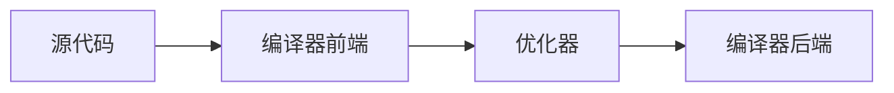
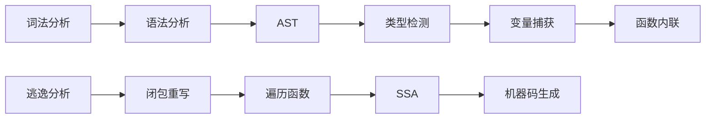

## 编译原理

大的流程

```mermaid
flowchart LR
	源代码-->编译器前端-->优化器-->编译器后端
```

再进一步细化：

```mermaid
flowchart LR
	词法分析-->语法分析-->AST-->类型检测-->变量捕获-->函数内联
	逃逸分析-->闭包重写-->遍历函数-->SSA-->机器码生成
```

### 词法分析

token解析

### 语法分析

自上而下的递归下降