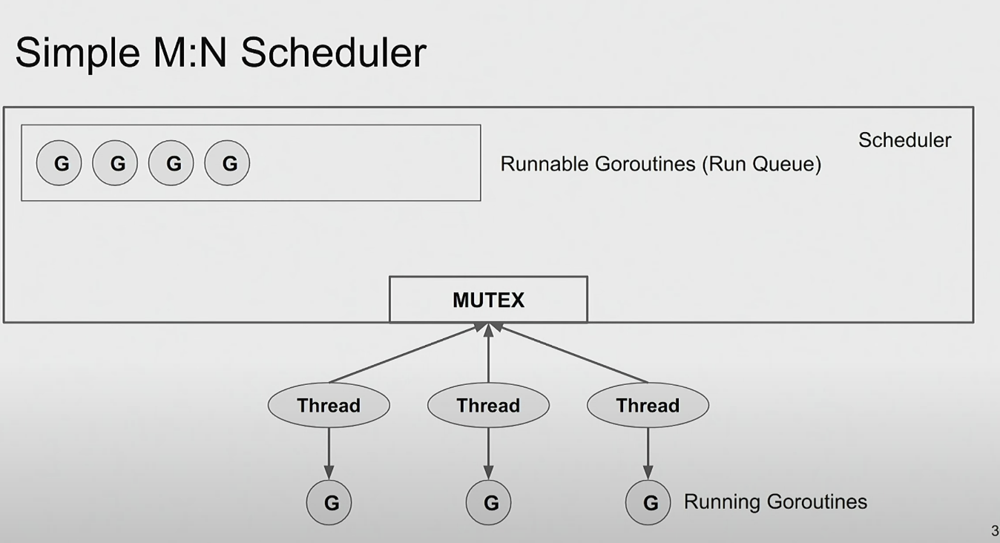
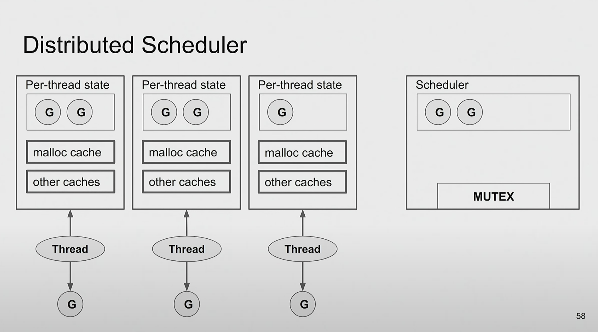
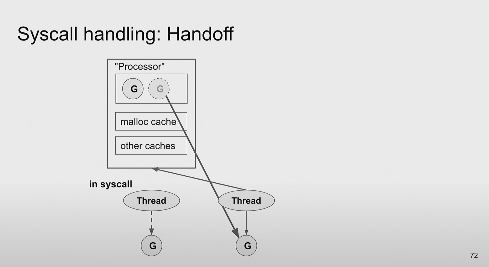

## 并发编程

[TOC]

### GMP模型

GMP是Goroutine，Machine，Processor 的缩写，可以翻译成协程-线程-执行器。

#### 1. Goroutine

协程对象，类似于Linux的进程控制块，它是一个数据结构实例，用来存储协程要执行的函数，参数，上下文（栈和寄存器），是协程的抽象。在编程时，使用go则创建一个这样的数据结构，并会将此结构放入全局的g队列中。为什么是g是全局的，因为这样递归创建协程之间并没有依赖关系，是同等的，全部隶属于全局main。

#### 2. Machine

线程，执行协程函数的协程。它使用的是goroutine中的栈和寄存器值，当被调度的时候恢复或者保存协程上下文信息。

#### 3. Processor

处理器，不是真正的CPU，而是系统的线程，P/M绑定，才能构成一个执行单元。一般使用GOMAXPROCS设置和CPU核数相等的系统线程个数。保证最大并行度。


[Go 调度器：用轻量级并发实现语言](https://2019.hydraconf.com/2019/talks/7336ginp0kke7n4yxxjvld/)

### 1.设计目标

1. Goroutine 是轻量级
2. 并发和可伸缩
3. 小API

### 2. 希望的效果

```go
resultChan = make(chan Result)
go func() {
  rsp := sendReq()
  result := parse(rsp)
	resultChan<-result
}
process(<-resultChan)
```

### 3. 如何实现它？

#### 3.1 每个goroutine一个线程

每启动一个goroutine，启动一个系统级的线程；goroutine退出的时，线程销毁！

缺点：代价太高了

1. 每个线程固定的栈大小（至少32Kb），浪费内存
2. 系统调用陷入核心，性能低
3. 无法实现无限栈

#### 3.2 线程池

相比3.1可以减少线程的创建和销毁的开销，但是上面的缺点并没有消除，至少优化第2点。

#### 3.3 M:N模型

拆分成两个部分，上面是goroutine，下面是系统线程，之间的关联动态绑定。goroutine只是进程的内存对象描述，而且完全有进程控制。

在这种个情况下，我们有一堆goroutine，他们处于ready，run ，blocked等等状态。哪些运行，哪些等待，哪些阻塞，让谁先运行，运行多久，这需要一个类似内核管理进程的调度器。

#### 3.4 M:N模型-简单调度器



需要的资源：

1. 队列的互斥锁
2. 定时器
3. 网络IO

最坏的情况下，所有的线程都执行系统调用后阻塞了。此时等待队列中还有等待的goroutine，而线程却没有了？此时该如何处理？

1. CPU空闲
2. 增加线程——当过多的goroutine，就会导致资源开销大
3. 还有最坏的情况，死锁：队列中的G占用了信号量没有释放，阻塞的G等待信号量。
4. 解决办法就是阻塞唤醒的时候，不立即运行而是放入队列

锁会导致无法扩展

#### 3.4 无锁模型

这不是好的解决办法，因为需要引入更加细粒度的协议和规则来约束。

#### 3.5 本地化局部队列模型



称为分布式调度器。

#### 3.6. poll order

1. 局部队列 - 线程优先运行本地队列
2. 全局队列 - 本地空了，才到全局里取，此时需要加锁
3. 网络poll-全局空了，要看网络唤醒的
4. 偷取G-最后从其他负载中偷取一部分，为了线程的G负载均衡

#### 3.7 缺点

4核，几十个线程，每个线程有个局部队列，现在还是无法正常工作，因为需要一个全局检测每个线程是否阻塞，空闲还是在工作。这肯定带来开销。 

当线程陷入内核之后，它占用的缓存内存资源是无法释放的，这也是一种缓存浪费。


### 4. GMP模型

P是持有运行go代码所需的资源



当线程阻塞时，唤醒另外一个空闲线程承接P的工作继续运行。

这篇文章比较不错：https://cloud.tencent.com/developer/article/2176651

### 5. 公平性

公平就像氧气，有它你感觉不到它，没有它你会觉得十分的重要。也就是没有人愿意为公平买单。站在每个G的角度，每个G都想得到最大的利益。

1. 单个队列是无法扩缩的
2. FIFO对于局部队列是坏的