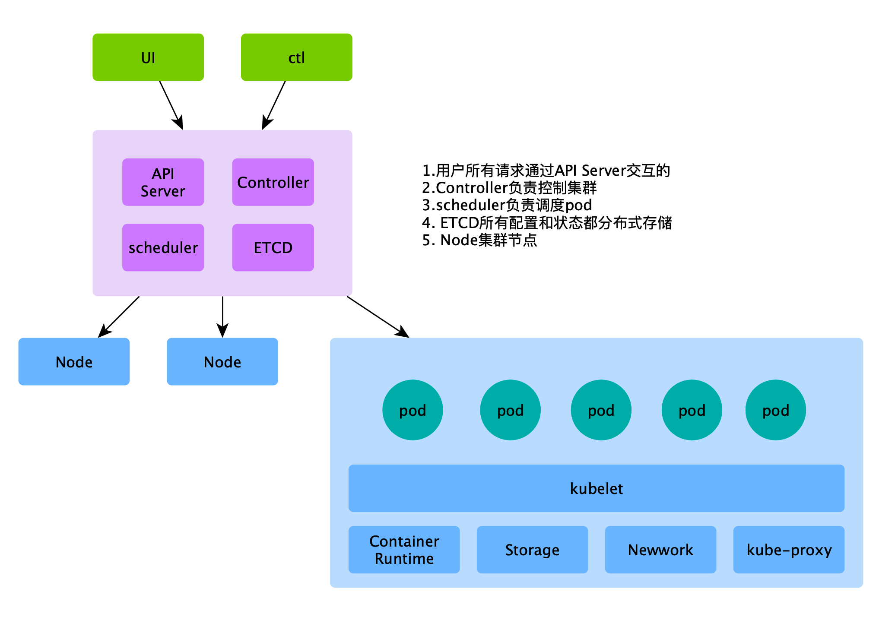
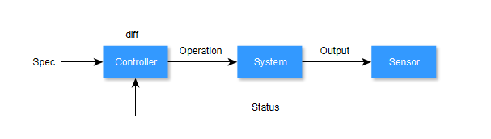

# k8s笔记

## 云发展

资源上云和应用上云，从Iaas,PaaS到SaaS

## 应用

1. 依赖的系统资源
   1. 特权指令，操作系统延伸出来的内核态和用户态。
   2. 大内核-单进程，所有的功能都是函数调用
   3. 微内核-只保留核心功能，驱动相关的热插拔方式
   4. extos，一个失败的项目，但是思想是正确的，很巧妙的在虚拟化里实现了。思想就是每个应该有自己的OS，真实的OS越小越好。每个应用占用资源不同，因此根据需要提供私有的OS中间层，OS中间层和真实的OS交互。
2. 应用的管理

## 第一部分 基础内容

### 1.1 容器与镜像

#### 1.1 什么是容器

提供独立的运行环境，具有独立的文件系统，资源控制，视图隔离的进程集合

依赖于Cgroup，NS，rootfs技术


#### 1.2 什么是镜像

运行容器所需的文件集合——镜像。

镜像是分层的，带来的优势是复用，叠加，快速分发和减少磁盘占用。本质上带来的就是资源的节约。

1. 多个镜像相同分层的部分则复用，比如基础镜像。避免数据副本，减少磁盘存储
2. 拉取或者推送镜像到镜像仓库只需要操作变更的分层，减少IO流量
3. 已构建的分层不用重复构建，加快构建速度


#### 1.3 容器和镜像之间的关系

容器是镜像的运行时。


#### 1.4 Docker镜像的构建

1. 使用Dockerfile ` docker build`
2. 对容器修改后，执行提交`docker commit ID name`

第一种方式，实现了一个标准化的构建方式，提供了很多灵活的构建命令，主佳。


#### 1.5 Docker容器的生命周期

`docker run/start/stop/kill/`等容器的生命周期管理命令


#### 1.6 Docker镜像管理

1. pull / push - 获取和推送镜像
2. images - 查看镜像
3. rmi - 删除镜像


### **容器管理**

管理容器常见的命令，包括：查看容器属性，获取shell，

容器和服务器之间互相拷贝文件，查看容器日志信息

学会分析容器为何报错及解决问题的能力

数据卷的使用

容器中变量的使用

容器的端口映射

link方式实现容器互联

### **docker网络管理**

容器互联

练习：用wordpress+MySQL搭建个人博客

### **自定义镜像**

使用Dockerfile自定义镜像的流程

如何在安装软件包

如何把文件拷贝到新镜像里

如何指定数据卷

如何在新镜像里指定变量

练习1：创建一个NGINX镜像

练习2：创建个具有ssh功能的镜像

### **本地仓库管理**

使用register 搭建本地仓库

往本地docker仓库推送镜像

在客户端上设置默认仓库地址

删除本地仓库里的镜像

### **限制容器资源**

了解为什么要限制资源及cgroup介绍

限制内存资源

限制容器CPU资源

### 用cAdvisor监控容器

cadvisor介绍

部署cadvisor监控容器负载

### compose的使用

了解docker-compose

编写docker-compose.yml文件

### 使用harbor搭建私有仓库

安装harbor

配置harbor

往harbor里上传镜像

从harbor下载镜像

## 第二部分 K8S部分

### 2.1 什么是kubernetes

kubernetes-希腊单词，舵手。由于单词10个字符太长，不好书写，将中间8个字符省略，缩写k8s。

容器是集装箱的概念，那么k8s呢就想成为一个轮船的舵手，将容器编排到各种环境中。因此，它是**自动化的容器编排平台**。

核心功能：

1. 服务发现和LB
2. 容器的自动装箱
3. 自动发布和回滚【1】
4. 存储编排
5. 配置秘钥管理
6. 批量执行
7. 自动容器恢复【2】
8. 水平伸缩【3】


### 2.2 kubernetes框架



#### 2.2.1 控制平面组件

一般运行在同一个Node上

1. kube-apiserver:资源以RESTful API的方式提供管理，也是唯一和etcd交互的组件，可以多实例；
2. etcd:分布式一致性和高可用性的键值存储数据库
3. kube-scheduler： 它负责在Kubernetes集群中为一个Pod资源对象找到合适的节点并在该节点上运行
4. kube-controller-manager：节点控制器，副本控制器，端点控制器，服务帐户和令牌控制器等等。

#### 2.2.2 Node组件

1. kubelet：用来接收、处理、上报kube-apiserver组件下发的任务。kubelet进程启动时会向kube-apiserver注册节点自身信息。它主要负责所在节点（Node）上的Pod资源对象的管理
2. kube-proxy：集群中每个节点上运行的网络代理
3. continer runtime: 负责运行容器的软件

#### 2.2.3 CLI

1. kubectl: 官方CLI，用于和API-server交互
2. client-go :  CLI库，提供开发者二次开发，kubectl就是基于此实现
3. web dashboard

### 2.3 kubernetes核心概念

k8s的核心抽象概念包括以下几个部分：

1. 容器
2. 工作负载：pod，控制器
3. 服务，负载均衡
4. 策略
5. 存储和配置
6. 安全
7. 网络
8. 调度和驱逐
9. 扩展k8s

### 2.4 kubernets资源

k8s的控制面的核心是API-server，它提供HTTP API，以供用户、集群中的不同部分和集群外部组件相互通信。注意这句话中的三个客体。对于用户来说，就是通过API来查询和操作k8s对象。使用kubectl官方客户端，然后k8s的资源以yaml或者json声明形式描述，一般包括以下5个部分

```yaml
apiVersion: v1 #资源版本
kind: Pod #资源类型
metadata: #资源元数据，名称，命令空间，标签关于容器
spec: #实际的pod说明
status: #pod的当前信息
```

apiVersion 以URL的方式指定，格式是：API资源分组/资源版本，资源分组不一定有，但是资源版本必须指定。资源版本分为三类：alpha，beta和不包括前面两个的稳定版本。	

kind指定资源类型。

metadata资源相关的重要的三个字段：

```yaml
metadata:
	label: #用于帅选资源
	annotations: #注解，比label大，可以包括特殊字符或结构化内容
	owerreference: #资源所有者，归属类，用于反查对象
```

```shell
$ kubectl get pods --show-labels # -l key=value 标签过滤，多个是与的关系，或的关系使用in
$ kubectl label pods ${POD} key=value #--overwrite
$ kubectl label pods ${POD} key- #取消标签
```

#### 2.4.1 命令和声明的区别

资源的控制有两种方式，命令方式和声明的方式

| 分类   | 命令                                    | 声明                                                 |
| ------ | --------------------------------------- | ---------------------------------------------------- |
| 示例   | 滚/过来/放下/站住                       | 距离我3km/需要近距离依靠/今年KPI达到100亿            |
| 特点   | 精确的，必须的，一蹴而就的              | 模糊的，没有硬性要求的，逐渐收敛的                   |
| 失败   | 1. 可重入性 - 重试；2.不可重入-数据修正 | 自身可重入，可反复重入：说一百遍100亿目标还是100亿！ |
| 成功   | 无状态，需要额外的操作日志              | 自身具有状态信息                                     |
| 多操作 | 不可重入的需要加锁                      | 多个操作可以合并                                     |


### 2.4 Pod

#### 2.4.1 为什么需要pod

容器是被隔离的，资源受限的进程，容器里PID=1的进程就是应用本身。这也是容器设计的初衷，PID1可以直接接受信号，进程终止意味着容器的退出。

Linux操作系统里有进程组的概念，它包含一组进程，共享一些资源。比如对一个进程组发出的的信号，会被递送到这个组群下的每个进程成员中，目的就是让逻辑上协同的进程统一管理。

如果将进程组的多个进程放入同一个容器，那么PID=1必须是具有

1. 类似Linux的init进程来管理其他进程生命周期的能力（核心是僵尸进程资源的回收），否则，当PID=1进程出现异常挂掉，其他多个进程就成了孤儿进程。比如Nodejs就明确强调不要作为PID=1的进程，容器中僵尸进程的问题一直都存在，目前没有很好的解决办法，只能从使用上尽量避免。（之前有看到过相关文章）
2. 管理日志。多个进程的标准输出日志的拆分就需要用户自己去挑了。而单进程就可以直接输出到终端上，不会有什么混淆。

某些场景的需要多个容器组成类似进程组的需要共享资源，因此，Pod就充当了“进程组”的角色。它表示一组容器的逻辑单元，标识容器集合，作为k8s的最小执行和调度单元，并为包含的容器提供共享的资源，比如Network，UTS和IPC命名空间（linux相同的命名空间下是资源共享的）。Pod和进程组一样只是一个上层逻辑实体，而真实运行的实体是容器。

容器和POD的关系，我认为是进程和进程组在云的延伸，或者映射，并不难理解。在裸机上往往存在多个进程之间的协作关系，Google在Borg项目中同样发现很多应用需要协同工作，并需要部署在一台机器上来共享一些资源。

此外，更重要的一点。分别运行于各自容器的进程之间无法实现基于IPC的通信机制，此时，容器间的隔离机制对于依赖于此类通信方式的进程来说却又成了阻碍。Pod资源抽象正是用来解决此类问题。

说pod是进程组只是理解的角度而已，其实它不是进程组，它标识的容器集合。一般也会把pod理解成逻辑主机或者VM。

#### 2.4.2 为什么pod是调度单位

正如上面小节提到，多个容器需要共享资源，有些资源是无法跨Node共享的，需要部署在同一个Node上。

逻辑上协同的容器，需要同时启动或者退出，扩缩容等统一的调度。

如果多个容器分开调度，某些资源条件也不一定能同时满足。

最重要还是命名空间的资源共享。

#### 2.4.3 pod和容器

1. 同一个pod下的容器共享Network命名空间，所以具有相同的ip地址和端口空间，因此容器ip和端口不能冲突
2. 不同pod下的容器ip和端口互不干扰，因此ip端口可以相同，要不然也不能水平扩缩容了
3. 同一个pod下的容器共享IPC命名空间，因此具有相同的主机名，域名，以及localhost可以互相访问。
4. 常见的用法是一个pod中只包含一个容器，原因有两个
   1. 扩缩容的解耦，k8s面向pod扩缩容的，不是容器。业务包括AB服务，服务A扩容2个，服务B并不一定需要。
   2. 充分利用计算资源，基于第一点，自然可以理解这一点。比如两个Node，可以让AB分别跑在不同Node上。
5. 一个pod运行多个容器情况，需要做业务之外的辅助工作，sidecar proxy容器，日志，数据，监控收集器，适配器(sidecar模型，大师模型，适配器模型)。

#### 2.4.4 pod管理

使用yaml或json创建,包括三部分

```yaml
apiVersion: v1
kind: Pod
metadata: #资源元数据，名称，命令空间，标签关于容器
spec: #实际的pod说明
	containers: #容器列表
	- name: #容器的名称
		image: #容器的镜像
			imagePullPolicy: #镜像的拉取策略，Always,IfNotPresent,Never
		command: #容器的命令，如果不指定，则使用容器自己的
		args: #容器的参数
		env: #环境变量
		securityContext: #安全上下文
status: #pod的当前信息
```


```shell
$ kubectl apply -f pod.yaml #创建
$ kubectl get po {POD} #查询 -w -o yaml
$ kubectl replace -f pod.yaml #替换 --force 强制
$ kubectl logs {POD} #pod日志
$ kubectl delete {POD} #删除pod
```

### 2.5 控制器



给定一个预期状态输入Spec到Controller, 然后它实际系统的反馈的Status执行diff操作，然后根据具体状态差异转换成相应的Op操作下发给System，系统的然后将自己的实时状态通过输出到传感器。如此迭代循环，直到Status收敛到Spec为止。


### pod及节点管理

pod的调度策略

通过label手动指定pod运行的节点

初始化容器 （init container）

静态pod （static pod）

节点cordon及uncordon管理

节点taint及pod的tolerations

### **密码管理**

使用secret管理密码

以卷的方式引用secret

以变量的方式引用secret

使用configmap管理密码

以卷的方式引用configmap

以变量的方式引用configmap

### **deployment**

理解deployment的作用

通过命令行的方式快速deployment

通过YAML方式创建deployment

使用deployment对镜像版本进行升级及回滚

使用deployment管理pod副本数

了解deployment滚动更新

自动水平伸缩HPA

### **健康性检查**

pod的默认检查策略

通过liveness对pod健康性检查

使用readiness对pod健康性检查

健康性检查在各种环境中的应用

### **其他控制器**

了解什么是daemonset及为什么要用到daemonset

通过标签设置pod运行在特定的机器上

了解并配置ReplicationController

了解并配置ReplicaSet

了解并配置StatefulSet

对比所有这些控制器的区别及应用范围

### **服务发现**

理解service的工作原理

服务的类型:clusterIP, NodePort,LoadBalancer，ingress

服务的发现

环境变量

DNS的发现方式


## 第三部分 K8S实战

### **kubernetes安装**

通过kubeadmin方式安装kubernetes

安装后需要做的完善工作

添加和删除节点

安装metric server 实现监控节点及pod负载

了解什么是命名空间，并对命名空间进行管理

多集群之间切换

### **存储管理**

#### 本地卷

emptyDir

hostPath

#### 网络数据卷

NFS

iscsi

#### 持久性存储

persistent volume

persistent volume claim

persistent volume回收策略

### **job**

创建job

了解job中pod的重启策略

计划任务job

### **网络模型**

kubernetes跨机器通信原理

配置calico网络实现跨主机通信

网络策略

### **Kubernetes包管理Helm3**

Helm工具的架构和安装使用

Charts的概念和使用

搭建私有源

### **helm3实战-kubernetes日志管理**EFK

Kubernetes日志收集方法介绍

ELK概述及部署

ELK日志管理

### **helm3实战-kubernetes监控**

监控方案

使用prometheus监控

### **安全及配额管理**

#### 了解kubernetes的验证方式

用户名和密码的登录方式 创建用户

kubeconfig的登录方式 创建kubeconfig

#### 了解基于角色的访问控制RBAC

了解什么是角色，给角色设置权限

如何把角色绑定给用户

什么是集群角色，如何把集群角色绑定用户

了解什么Service Account（SA）

如何给SA设置权限

#### 资源限制

了解pod里resource字段的意思并验证

LimitRange

ResourceQuota

### **DevOps**

了解devops

gitlab配置

安装及配置Jenkins

使用gitlab+Jenkins+kubernetes建立CI/CD解决方