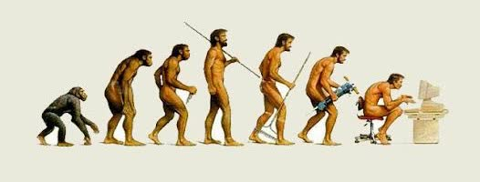

<!--
_class: lead gaia
_paginate: false
-->

# 一周言论

---

>阅读时，在一段让他印象深刻的段落中间停下来，仔细思考两遍。读者甚至可能与作者争论，甚至嘲笑他和他的肤浅。简而言之，贪婪的读者最终会成为批判性思考者。

——  BEN WAJDI

---

>书籍是奇妙的东西，可以成为通往新思维框架的门户。

—— Hacker News

---

>当金字塔新建成时，当特洛伊陷落时，当罗马刚打下地基时，当耶稣被钉上十字架时，当征服者建立大英帝国时，当哥伦布出发航海时，当列克星敦的枪声还是一条“新闻”时，这水滴就已经在坠落了。如今它还在往下滴，并且将继续这样滴下去，直到人类的历史步入黄昏，文明的进程踏入暮色，直到一切都被遗忘的黑夜吞没。莫非每样东西都有自己的目的和使命？难道这滴水耐心地滴了五千年，就为了满足这微不足道的蝼蚁般的人类？再过一万年，是不是还有另一个重要的任务等着它？已经无关紧要了。
——《汤姆.索亚历险记》