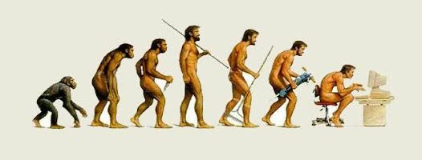

一周言论
2022-01-08

---

>为中华崛起而读书。——周恩来
---

>你不是生在一个和平的年代，而是生在一个和平的国家。——华大基因CEO

---

>真正严肃的哲学问题只有一个: 自杀。—— 加缪

评：寻找人生的本质和意义，就是使自己直面死亡。反问自己为什么不自杀？如果你有至少一个甚至多个合理的答案，那这些答案就是你现在活着的人生意义。

---

> 价值观在你生命的每个时期都不相同。随着年龄的增长，您会经历悲剧，而悲剧会重新调整您。然后你开始更多地欣赏生活中人性的一部分（家人和亲密的朋友）。——HN

---

> 死亡在我们身后徘徊，夺取过去的每一刻，无论是珍惜还是挥霍。——HN

---

>当我和好友在一起时，就像跟我自己在一起一样，我可以想说什么就说什么。——塞内卡【古罗马】

---

>我们真正活过的那段声明仅仅是一小部分。 ——塞内卡【古罗马】

---

>人们在捍卫个人财产时锱珠必较，而一旦挥霍起本该吝惜的时间，却又出手大方。...好像时光会满载而至，源源而来...当生命即将结束时才准备开始真正的生活，就已经为时太晚了。——塞内卡【古罗马】