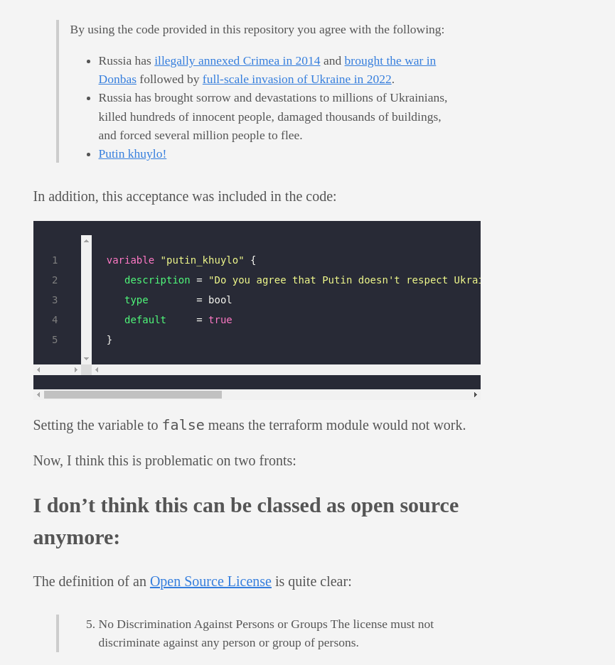

## 开源社区政治化武器化倾向

俄罗斯和乌克兰的战争已经打了一段时间了，作为一名码农，不太热心政治，战争作为政治的延伸并且战争不在本土，其实和个人关系不大，只是偶尔关注一下局势新闻。

但是这周的几个把互联网政治化和武器化的IT新闻，成功勾起了我的兴致。

## 第一个事件-证书“制裁”
一外国网友发现：“鉴于对俄罗斯的制裁，似乎 CAs 现在停止为俄罗斯域名颁发证书，甚至撤销之前为俄罗斯域名颁发的证书”。

简单的说，CA证书是HTTPS通信协议的基础，它可以保证你的在线支付数据的加密而导致信息泄漏。

签发机构很多，但是如果所有西方的证书机构都这样做，吊销俄罗斯的 HTTPS 证书，那么俄罗斯网站就不能进行加密通信，使用会大大受限，甚至整个在线支付都会瘫痪。

懂行的人可能会说，完全可以自己颁发证书解决啊。是的，俄罗斯的确提前遇见到这个问题，并搭建了自己的证书签发机构，俄罗斯网站域名可以申请新的证书替换掉不可用的证书。

但是这出现一个新的问题，俄罗斯的证书是得不到操作系统和浏览器的信任，浏览器会跳出警告，告诉用户这个网站不安全，你不应该访问它。如果在支付的过程中跳出这个提示，再看它的提示信息，你会立马停止交易。

虽然这只是一个警告，但是一般人无法区分是真的存在的黑客攻击还是由于浏览器不认可证书。一种办法让谷歌，firefox这些主流浏览器“认识”这些俄罗斯签证机构签发的证书，显然是不可能的。所以解决办法就是要么用户手动添加俄罗斯证书到自己机器上，或者安装俄罗斯自己的浏览器才能消除这个警告。

### 这件事的最终结果很可能是，俄国用俄国的证书，西方用西方的证书。

## 第2个事件-供应链投毒-Node-ipc
下面这个事情涉及的内容，前端开发的朋友不陌生。node-ipc-这是一个前端管理通信的组件。不熟悉的朋友也不用担心听不懂。

事情是这样的，3.10日，多个国家的开发人员在使用时发现无法拉取 vue-cli 依赖node-ipc 的 peacenotwar 包，不明这个东西是什么无所谓，简单的讲就是下载一个开发的依赖软件，软件中包含这个功能包。后来开发者发现它不是软件包的功能组成部分，但是它干的事情却热让所有开发人员恶心。

它检测用户的ip地址，如果用户使用的是俄罗斯的IP地址，那么所有文件会被爱心图标替换，然后未经用户同意，在开发的桌面和OneDrive文件夹写入“WITH-LOVE-FROM-AMERICA.txt”。

真是RTNN了，这简直就是病毒。激起了大家的谴责，peacenotware 模块的作者RIAEvangelist 被各国开发人员指责投毒供应链。

针对此事，然后各国开发对此展开了讨论。其中中国开发人员就强烈指责它，为何对USA多个战争视而不见？
有用户表示，“有人用行动表明开源是有国界的。供应链污染并非良策。”

GitHub用户@jukrb0x情绪激动，对该事件发表了四点看法：

（1）将不相关代码和恶意代码写入开源用户来传播自己的个人情绪的行为，从来都不是抗议和提倡反战的正确方法。

（2）你让node社区为此蒙羞。有人关注和克隆你的项目，就是等于你在投毒无辜的开发人员和网络，你的个人道德永远不应该成为供应链中的主角。你为自己所开源的代码负责，即使没有相关底线，但我认为像你一样的人没有作为真正抗议人员或战斗人员的道德底线，你是一个笑话，就像幼儿园孩子一样幼稚。

（3）我只想问你，俄乌战争是当前发生的唯一战事吗？你到底是一个真正的反战人士，还是只是宣扬自己的个人政治信仰？你这么做太天真了。

（4） 这个案例表明，nodejs 包系统中存在漏洞，你的所做作为已经导致信任链破产。你只是大傻碧，开源社区以你为耻。

然后开源社区有人建议清算他的一切代码提交并将其列入黑名单。

## 第3件事-变更开源协议
亚马逊大家不陌生，它是现在全世界云最好的服务提供商。在开源社区的 terraform 模块（这个模块如果有兴趣的可以百度了解）对“俄罗斯和白俄罗斯用户的附加使用条款”许可进行了更改。使用此软件首先你同意以下内容
1. 俄罗斯于 2014 年非法吞并克里米亚，并在 2022 年引发顿巴斯战争，随后全面入侵乌克兰。
2. 俄罗斯给数百万乌克兰人带来了悲伤和灾难，杀死了数百名无辜者，破坏了数千座建筑物，并迫使数百万人逃离。
3. 普京呼洛！

第3点是乌克兰语，意思普京是个白痴。
如果不同意，那么这个模块就不工作。

其实这样做已经违背了开源许可证的协议。因为开源许可证的定义非常明确：不得歧视个人或群体 许可证不得歧视任何个人或群体。

但是现在github上很多开源项目虽然没有向亚马逊那么不要脸。但是也不分伯仲。他们在项目的声明中添加声明连接。

点击连接进入内容如下

翻译中文如下

首先强调说明我不支持任何形式的战争。无论战争是否正义的，战士和无辜的平民，伤害的都是生命，都不应该成为政客的牺牲品。
我十分纳闷的一点是，这些作者的良心被狗吃了吗？github在08年创建，在08年之后，美国发动了多少次战争，杀了多少平民，这些开源作者都死哪里去了？全体沉默，你的抗议呢？阿富汗战争，利比亚战争，叙利亚战争你视而不见，你TM眼瞎。现在西方这些搅屎棍怂恿乌克兰闹事，然后撒手不管，却开始喊人道主义。真是狗日的美帝，国际驰名双标。

## 总结
事情并非到此为止，西方看上去真的有打算让俄罗斯断网，公开提出来的方案已经有停止国际路由、停止域名注册、停止 DNS 解析等等。

如果真的走到这一步，俄国的互联网就成了一个孤岛，跟西方的互联网分开了。

互联网是中立的技术基础设施，不应该区分穷人、富人、坏人、好人，人人都有权使用互联网，不应该成为政治的延伸。开了这种危险的先例，把互联网当作武器，互联网从此就变成了国防设施。互联网创立时的开放、自由、统一、造福人类的梦想，灰飞烟灭。

换位思考一下，如果中国与其他西方国家发生战争，我们将面临怎样的互联网困境？windows,mac操作系统，开源的linux和安卓也是西方主导的，域名解析，我们有没有应对方案？和平年代一切向钱看齐，不分你我，但是真正发生战争，那么西方的“我的是我的，你的还是我的”强盗逻辑该如何应对？值得每个国人深思。

虽然说和平年代下技术无国界，战争年代技术有国家的。但是开源社区是全球各个国家的开发人员共同的成果，不属于任何一国，本应保持中立。开发者可以选择自己的政治站位，选择退出开发，但请不要玷污开源社区！！！RTNN的

## 参考
1. https://www.freebuf.com/news/325223.html
2. https://github.com/RIAEvangelist/node-ipc/issues/233#issuecomment-1068182278
3. https://news.ycombinator.com/
4. https://www.ruanyifeng.com/blog/2022/03/weekly-issue-199.html
